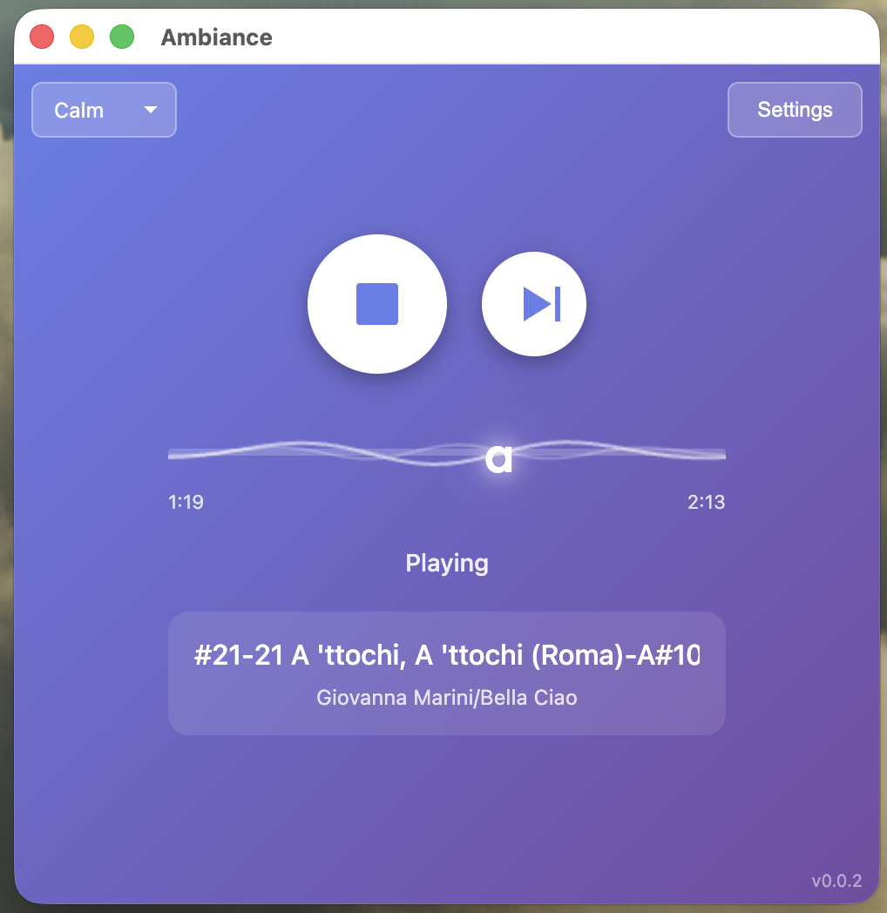
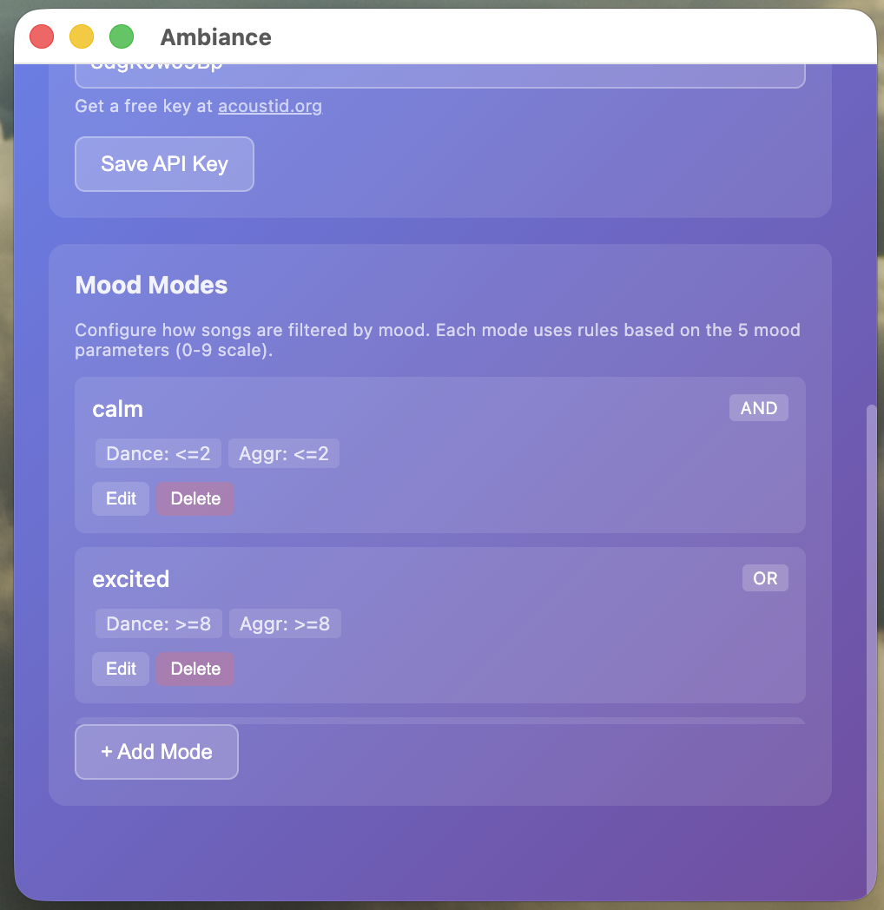

# Ambiance

A macOS MP3 player with intelligent music organization, mood analysis, and lazy playlist management.

## Screenshots

| Player                             | Settings                             |
|------------------------------------|--------------------------------------|
|  |  |

## Quick Start (macOS)

Got a folder full of MP3s? Here's how to get started:

```bash
# 1. Clone and install
git clone https://github.com/mlefree/ambiance.git
cd ambiance
npm install

# 2. Install Chromaprint (optional, for better metadata detection)
brew install chromaprint

# 3. Build and install the app
npm run package:dmg:install
```

4. Launch Ambiance, click **Settings** and select your music folder.

The app will automatically:

- Scan your folder for MP3 files
- Analyze mood using AI (TensorFlow.js)
- Organize files into `Artist/Album/` structure
- Create smart playlists filtered by mood

## Development

For local development with hot reload:

```bash
# Configure environment
cp .env.example .env
# Edit .env and set AMBIANCE_FOLDER=/path/to/your/mp3s

# Build and run locally
npm run build
npm start
```

## Features

- **Smart Playlist Queue**: Maintains up to 20 songs ready to play
- **Automatic Organization**: Organizes files into `Artist/Album/` structure
- **Mood Analysis**: Analyzes songs with 5-dimensional mood codes using TensorFlow.js
- **Mood Filtering**: Filter playlist by mood (calm, neutral, excited)
- **Metadata Extraction**: Uses ID3 tags + optional AcoustID fingerprinting
- **Media Key Support**: F8 (play/pause), F9 (next track)
- **Quarantine System**: Invalid files moved to `_quarantine/` folder

## Scripts

| Script                      | Description                       |
|-----------------------------|-----------------------------------|
| `npm run build`             | Compile TypeScript                |
| `npm start`                 | Start the application             |
| `npm run clean:build:start` | Reset test folder and start fresh |
| `npm run bp:style:fix`      | Fix code style issues             |
| `npm test`                  | Run tests                         |
| `npm run package:dmg`       | Build macOS DMG installer         |

### Testing Modes

```bash
node scripts/test-mock-all.cjs   # No API calls, no file modifications
node scripts/test-mock-api.cjs   # No API calls, with file modifications
node scripts/test-mock-user.cjs  # With API calls (rate limited)
```

## Project Structure

```
src/
├── main.ts                      # Electron main process
├── preload.ts                   # IPC bridge
├── renderer/
│   ├── renderer.ts              # UI + mood analysis (TensorFlow.js)
│   └── settings.ts              # Settings UI
├── services/
│   ├── playlistTrackerLazy.ts   # Playlist queue management
│   ├── fileProcessor.ts         # File validation & organization
│   ├── audioPlayer.ts           # Audio player state
│   └── configStore.ts           # Persistent configuration
└── utils/
    ├── fileValidator.ts         # Filename & mood validation
    ├── fileOrganizer.ts         # File organization
    └── mp3Finder.ts             # File discovery
```

## File Format

**Filename:**

```
<Artist>-<Album>-#<Track>-<Title>-A#<MoodCode>-B#<BPM>.mp3
```

**Directory structure:**

```
AMBIANCE_FOLDER/
├── Artist/
│   └── Album/
│       └── Artist-Album-#01-Title-A#55374-B#120.mp3
└── _quarantine/  # Invalid files
```

**Mood Code (A#XXXXX):** 5 digits (0-9), representing:

1. Danceability
2. Happy
3. Sad
4. Aggressive
5. Relaxed

Example: `A#30919` = low danceability, not happy, very sad, calm, very relaxed

## Architecture

### Playlist Flow

1. **Discovery**: Scans music folder, categorizes files (organized vs unorganized)
2. **Processing**: Extracts metadata, analyzes mood, organizes files
3. **Playback**: Songs consumed from playlist, auto-refills when low

### Mood Analysis

Uses TensorFlow.js with Essentia.js feature extraction:

- 5 MusiCNN models (danceability, happy, sad, aggressive, relaxed)
- Runs in renderer process for full audio quality analysis
- Results stored in filename and ID3 tags

## License

**Application**: MIT License - see [LICENSE](LICENSE) file.

**Mood Analysis Models**: The pre-trained MusiCNN models are licensed under [CC-BY-NC-ND 4.0](https://creativecommons.org/licenses/by-nc-nd/4.0/) by the Music Technology Group, Universitat Pompeu Fabra. See [models/LICENSE](models/LICENSE) for full attribution.

This software is intended for **personal, non-commercial use**. Commercial licensing for the models is available from [MTG/UPF](https://www.upf.edu/web/mtg/contact).
